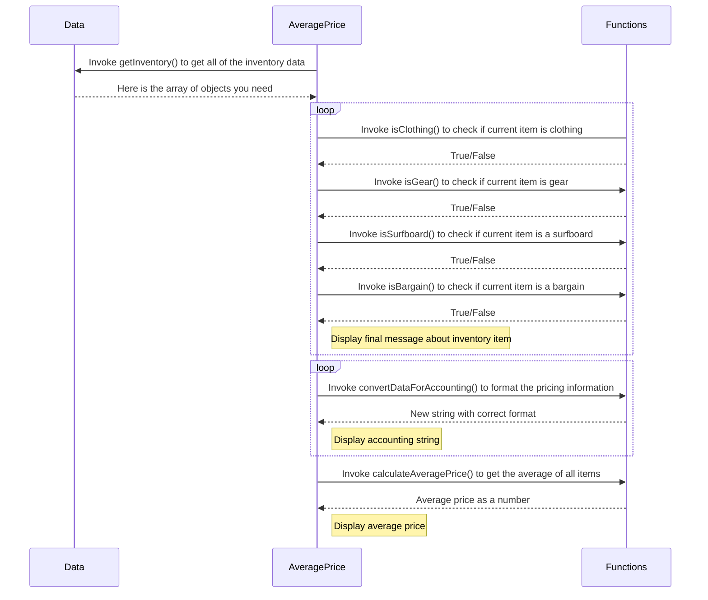

## Purpose:

### Review and practice in using Debugger.

### Review and practice in sequenceDiagram.

```mermaid
sequenceDiagram
   participant Data
   participant AveragePrice
   participant Functions
   AveragePrice->>Data:Invoke getInventory() to get all of the inventory data
   Data-->>AveragePrice:Here is the array of objects you need
   loop
   AveragePrice->Functions: Invoke isClothing() to check if current item is clothing
   Functions-->>AveragePrice: True/False
   AveragePrice->>Functions: Invoke isGear() to check if current item is gear
   Functions-->>AveragePrice: True/False
   AveragePrice->>Functions: Invoke isSurfboard() to check if current item is a surfboard
   Functions-->>AveragePrice: True/False
   AveragePrice->>Functions: Invoke isBargain() to check if current item is a bargain
   Functions-->>AveragePrice: True/False
   note right of AveragePrice: Display final message about inventory item
   end

   loop
   AveragePrice->>Functions: Invoke convertDataForAccounting() to format the pricing information
   Functions-->>AveragePrice:New string with correct format
   note right of AveragePrice: Display accounting string
   end

   AveragePrice->>Functions: Invoke calculateAveragePrice() to get the average of all items
   Functions-->>AveragePrice:Average price as a number
   note right of AveragePrice: Display average price
```